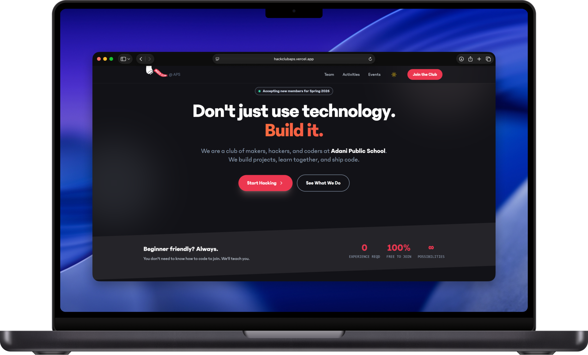

# Hack Club APS 🚀

The official website and codebase for **Hack Club APS** — a student-led coding club focused on building, learning, and shipping cool things.

> Think less theory, more shipping.


## 🌐 Live Site
👉 https://hackclubaps.vercel.app


## 📸 Mockup



## 🧠 What is Hack Club APS?

Hack Club APS is a local chapter of [Hack Club](https://hackclub.com), a global community of high school hackers.  
We build projects, host workshops, run events, and learn by doing.

This repo powers our **club website** — events, updates, and everything public-facing.


## 🛠 Tech Stack

- 
-  
-  
-  
-  

Minimal stack. Maximum speed.


## 📁 Project Structure

```txt
/ HackClubAPS
├─ src/
│  ├─ components/   # Reusable UI components
│  ├─ pages/        # Routes & pages
│  ├─ layouts/      # Page layouts
│  └─ data/         # JSON-based content
├─ public/          # Static assets
└─ astro.config.mjs
```

## 🚀 Getting Started

Clone the repo:

```bash
git clone https://github.com/Hack-Club-APS/HackClubAps.git
cd HackClubAps
```

Install dependencies:

```bash
npm install
```

Run locally:

```bash
npm run dev
```

Open `http://localhost:4321` in your browser.


## 🧩 Contributing

Contributions are welcome — especially from club members.

**How to contribute:**

1. Fork the repo
2. Create a new branch
3. Make your changes
4. Open a Pull Request

Keep it clean. Keep it readable.


## 📌 Ideas for Contributions

* New pages (events, gallery, blog)
* UI/UX improvements
* Performance optimizations
* Accessibility fixes
* Content updates

If it makes the site better, ship it.


## 🏫 About Hack Club

Hack Club is a nonprofit global network of high school coding clubs.
Learn more at [https://hackclub.com](https://hackclub.com)


## 📜 License

[MIT License.](./LICENSE)
Build freely. Learn loudly.


### Made with ❤️ by Hack Club APS
